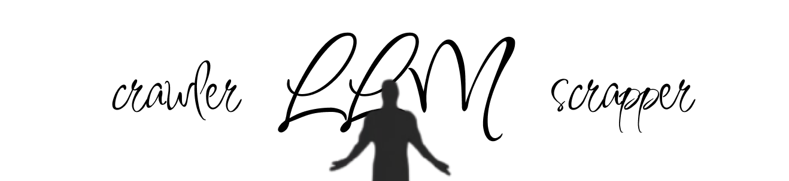
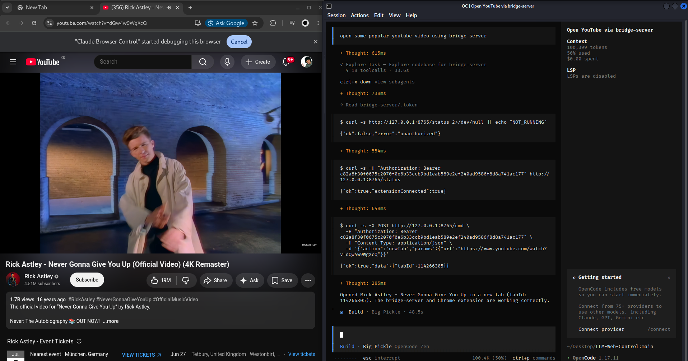

# LLM-Powered-Web

**Your local LLM-powered web crawler & scraper — your data stays with you.**

Turn any local coding LLM into a browser automation powerhouse. Crawl websites, scrape structured data, fill forms, take screenshots — all driven by LLMs running on **your own machine**. No API keys, no third-party servers, no data ever leaves your computer.

```
┌──────────────┐   HTTP POST /cmd    ┌──────────────┐   WebSocket   ┌──────────────────┐
│  Local LLM   │ ──────────────────▶ │ bridge-server │◀─────────────▶│ Chrome Extension │
│ (offline,    │   Bearer <token>    │  (Node, :8765)│               │  (background.js) │
│  private)    │                     └──────────────┘               └────────┬─────────┘
└──────────────┘                                                             │
                                                      chrome.debugger (CDP) / chrome.scripting
                                                                             ▼
                                                                      Your real Chrome tabs
                                                                     (cookies, sessions, data)
```

**Tested with:** Codex · Claude Code · OpenCode · Qwen 4B · Llama 3.3 · Kimi K2.6

---

## Superpower at Hand

| What you can do | How it works |
|---|---|
| **Crawl & scrape** | Navigate pages, extract DOM snapshots, read text, follow links — build crawlers in minutes |
| **Fill forms** | Type into fields, select options, click buttons, submit — automated with local LLM guidance |
| **Interactive automation** | Click, drag, scroll, press keys — trusted CDP input that real websites can't distinguish from human |
| **Screenshot & vision** | Capture full-page screenshots, let your LLM analyze them visually |
| **Multi-tab orchestration** | Open, close, switch, and manage tabs — crawl in parallel |
| **Canvas & Shadow DOM** | Coordinate-based interaction when DOM selectors aren't available |

**Your data never leaves your machine.** Every command stays local. No API keys, no cloud, no third party.

---



---

## Quick Start

**Prerequisites:** Node.js 18+, Google Chrome (or Brave, Edge, Chromium).

```bash
# 1. Install the bridge server
cd bridge-server
npm install

# 2. Start the bridge (prints a token)
npm start
```

```
[bridge] listening on http://127.0.0.1:8765
[bridge] token (paste into extension popup): c82a8f30...
```

**Keep this terminal running.**

```bash
# 3. Load the Chrome extension
```
Open `chrome://extensions`, enable **Developer mode**, click **Load unpacked**, and select the `extension/` folder.

```bash
# 4. Connect
```
Click the extension icon, paste the token from step 2, click **Save**. The badge turns green **ON**.

```bash
# 5. Start crawling
```
Tell your LLM what to do — it drives everything through the bridge.

---

## Step-by-Step Setup

### 1. Install & start the bridge

```bash
cd bridge-server
npm install
npm start
```

On first launch, a random 256-bit token is generated and saved to `bridge-server/.token` (gitignored). The token is printed to the terminal — you'll need it to connect the extension.

### 2. Load the extension in Chrome

1. Open `chrome://extensions`
2. Toggle **Developer mode** (top-right corner)
3. Click **Load unpacked**
4. Browse to and select the `extension/` folder
5. The extension appears in your toolbar

### 3. Connect the extension

1. Click the extension icon
2. Paste the token from the terminal
3. Click **Save**

The badge turns from dim to green **ON** — the extension is now connected to the bridge.

### 4. Verify it works

```bash
cd bridge-server
TOKEN=$(cat .token)
curl -s -H "Authorization: Bearer $TOKEN" http://127.0.0.1:8765/status
```

Expected response:
```json
{"ok":true,"extensionConnected":true}
```

### 5. Send your first command

```bash
curl -s -X POST http://127.0.0.1:8765/cmd \
  -H "Authorization: Bearer $TOKEN" \
  -d '{"action":"snapshot"}'
```

This returns a structured snapshot of the active page — interactive elements, CSS selectors, bounding boxes.

### 6. Turn your LLM loose

From here, your coding LLM drives the browser. Just ask it to:

> Crawl example.com and extract all article links.
>
> Search Google for "local LLM" and save the first page of results.
>
> Fill out this login form and take a screenshot of the dashboard.

---

## Crawl & Scrape Workflow

```
1. snapshot ──▶ Get structured DOM (selectors, text, links, forms)
2. extractText ──▶ Read targeted content
3. screenshot ──▶ Visual fallback for complex UIs
4. click / type / scroll ──▶ Navigate and interact
5. Repeat ──▶ Build multi-page crawl pipelines
```

The `snapshot` action returns interactive elements with ready-to-use CSS selectors. When selectors aren't available (canvas, Shadow DOM), your LLM falls back to screenshots + coordinate-based clicking.

---

## Project Structure

```
llm-web-control/
├── bridge-server/      Local Node.js bridge (HTTP + WebSocket)
│   ├── server.js       Main server (~170 lines)
│   ├── package.json    Single dependency: ws
│   ├── .token          Auth token (gitignored)
│   └── screenshots/    Saved screenshots
├── extension/          Chrome MV3 extension
│   ├── background.js   Service worker (~340 lines)
│   ├── manifest.json
│   ├── popup.html
│   └── popup.js
├── docs/               Documentation
│   ├── README.md       Full setup & usage guide
│   ├── ARCHITECTURE.md How it works
│   ├── COMMANDS.md     Complete command reference
│   ├── SECURITY.md     Security model & privacy
│   ├── TUTORIAL.md     Step-by-step walkthrough
│   └── imgs/           Screenshots & diagrams
└── README.md           This file
```

---

## Documentation

| Document | What's inside |
|---|---|
| [docs/README.md](docs/README.md) | Full setup guide, daily usage, configuration |
| [docs/ARCHITECTURE.md](docs/ARCHITECTURE.md) | Protocol design, why CDP, command flow |
| [docs/COMMANDS.md](docs/COMMANDS.md) | Every action, parameter, and response |
| [docs/SECURITY.md](docs/SECURITY.md) | Threat model, data privacy, best practices |
| [docs/TUTORIAL.md](docs/TUTORIAL.md) | Click-by-click walkthrough from zero to automation |

---

## Why Local LLMs?

| Cloud-based tools | LLM-Powered-Web |
|---|---|
| Send your data to third-party APIs | Everything stays on your machine |
| Require API keys & billing | Zero API costs |
| Rate-limited and throttled | Unlimited local usage |
| Data privacy concerns | **Your data stays with you** |
| Internet required | Works fully offline |

---

## License

MIT
